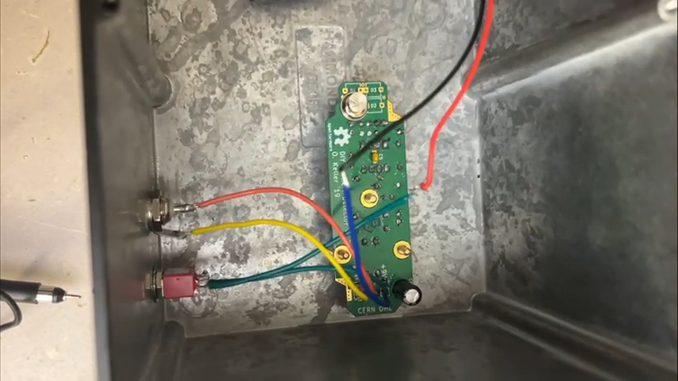
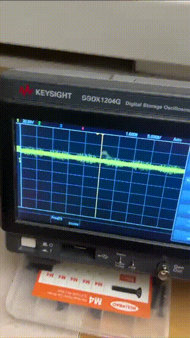
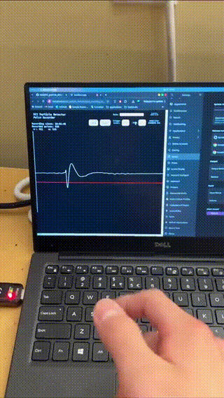
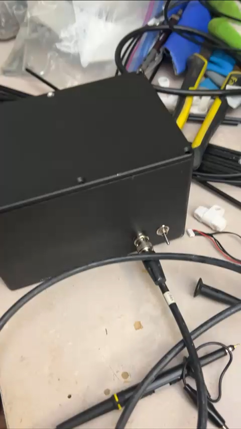
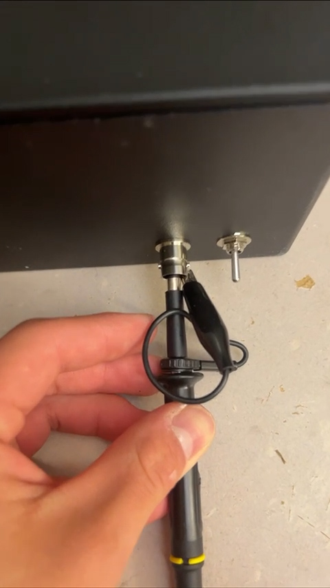

# Alpha Particle Detector

A solid-state alpha particle detector based off of [CERN'S DIY Alpha Particle Detector](https://github.com/ozel/DIY_particle_detector) design.

## Emissions from 241Am

 

## Enclosure

## Probing

## Contact

- [Tian Yi, "Alex", Xia](https://github.com/ThatAquarel), xtxiatianyi@gmail.com: 

## References

- CERN DIY Particle Accelerator, https://ozel.github.io/DIY_particle_detector/
- Keller, O., Benoit, M., Müller, A., & Schmeling, S. (2019). Smartphone and Tablet-Based Sensing of Environmental Radioactivity: Mobile Low-Cost Measurements for Monitoring, Citizen Science, and Educational Purposes. Sensors, 19(19), Article 19. https://doi.org/10.3390/s19194264
